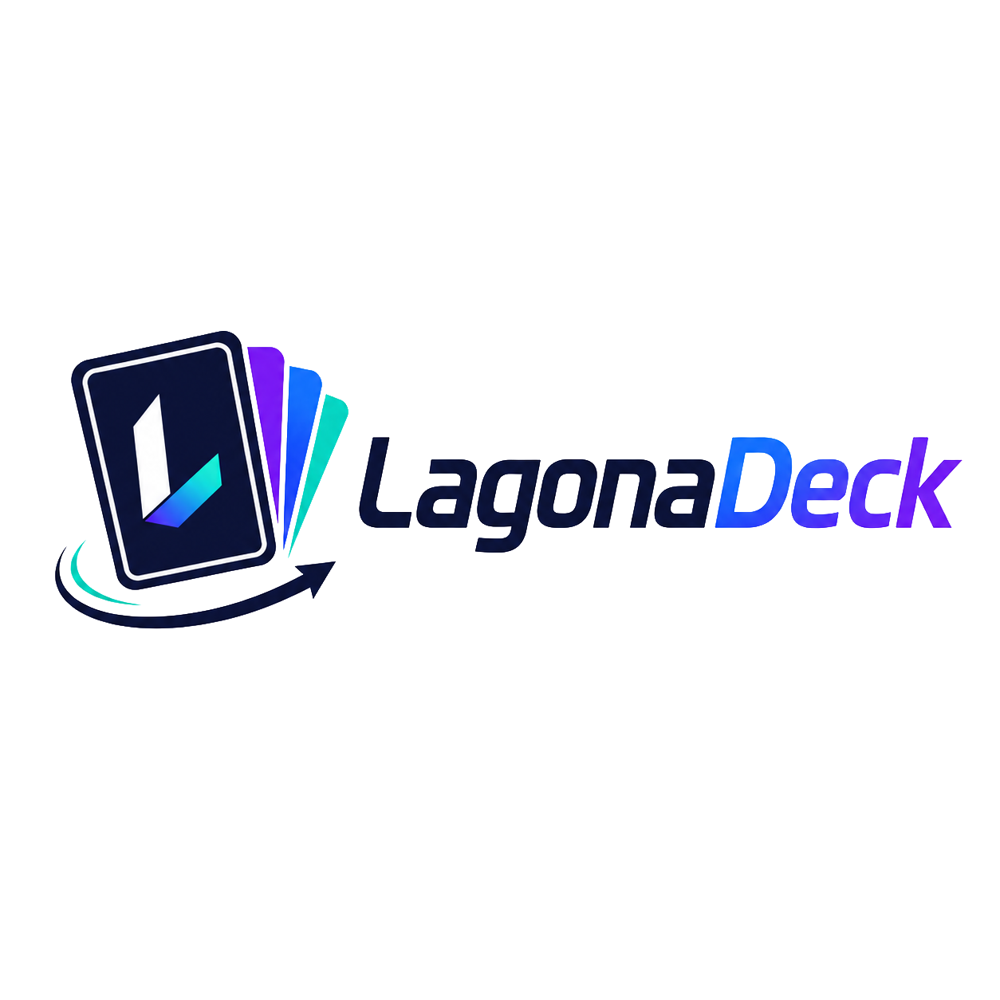

<p align="center">
  
</p>

# LagonaDeck

**LagonaDeck** est une application ERP destinée aux particuliers et professionnels qui achètent et revendent des cartes à collectionner **TCG (Trading Card Games)** dans une logique de _flipping_.

L'objectif de LagonaDeck est de centraliser l'ensemble du cycle de vie d'une carte, depuis son acquisition jusqu'à sa revente, tout en permettant de suivre précisément le stock, les coûts, les prix du marché et la rentabilité.

L'application permet notamment de gérer les achats de cartes par lots, de répartir dynamiquement le coût d'un lot entre les différentes cartes, de suivre l'évolution du stock, d'enregistrer les ventes et de calculer automatiquement les marges, bénéfices et retours sur investissement.

LagonaDeck intègre également un système de **workspaces multi-utilisateurs**, permettant à plusieurs personnes de gérer un même inventaire tout en conservant une séparation claire entre différents espaces de travail.

Les données du marché peuvent être utilisées afin de comparer le coût d'acquisition d'une carte à sa valeur actuelle et ainsi faciliter les décisions de vente.

## Fonctionnalités principales

- Gestion des utilisateurs et des workspaces
- Gestion d'un catalogue de cartes TCG
- Gestion des achats et des lots
- Allocation dynamique du coût d'acquisition d'un lot
- Gestion et suivi du stock
- Suivi des prix du marché
- Gestion des ventes et des frais associés
- Calcul des bénéfices, marges et ROI
- Historique et analyse des performances
- Tableau de bord avec indicateurs financiers et statistiques
- Gestion des médias (photos des cartes)

## Architecture

LagonaDeck est un monorepo **Nx** en TypeScript : un frontend **Angular 22 +
NgRx** appelle une **API Gateway NestJS**, qui constitue l'entrée prévue des six
services métier NestJS. Chaque service possède son schéma Prisma et sa base
PostgreSQL ; Media Service gère les métadonnées et l'accès au stockage compatible
S3.

La documentation décrit précisément l'état actuel et les éléments prévus :
[architecture](docs/architecture/README.md),
[diagrammes Mermaid](docs/diagrams/architecture.md) et [ADR](docs/adr/README.md).

## Structure du monorepo

Le dépôt est un **monorepo [Nx](https://nx.dev)**.

```text
apps/
  frontend/            Angular + NgRx
  api-gateway/         NestJS (passerelle, sans base)
  identity-service/    NestJS + Prisma
  catalog-service/     NestJS + Prisma
  inventory-service/   NestJS + Prisma
  sales-service/       NestJS + Prisma
  analytics-service/   NestJS + Prisma
  media-service/       NestJS + Prisma + object storage
libs/
  contracts/           contrats d'API et d'événements partagés
  shared/              types, validation, utils
  observability/
  testing/
infrastructure/        structure Docker et RabbitMQ (configuration à compléter)
docs/                  architecture, diagrammes, API, ADR
```

## Stack technique

- **Frontend** : Angular, NgRx
- **Backend** : NestJS (API Gateway + microservices)
- **ORM** : Prisma 7 (database-per-service, driver adapter PostgreSQL)
- **Base de données** : PostgreSQL (une par service)
- **Messagerie** : RabbitMQ (communication asynchrone)
- **Stockage média** : object storage compatible S3 (client du Media Service)
- **Monorepo & outillage** : Nx, TypeScript, ESLint, Prettier
- **Conteneurisation** : Docker / Docker Compose

## Démarrage

```bash
# Installer les dépendances
npm install

# Générer le client Prisma d'un service
npm run db:generate -w @lagonadeck/identity-service

# Lancer un service en développement
npx nx serve identity-service

# Construire toutes les applications
npx nx run-many -t build
```

> Le client Prisma généré (`apps/*/src/generated/`) et les fichiers `.env` ne sont pas versionnés. Les URLs de connexion et l'infrastructure locale (PostgreSQL, RabbitMQ et stockage objet) restent à configurer.

## Objectif du projet

LagonaDeck est réalisé dans le cadre d'un **projet académique en informatique** par une équipe de quatre développeurs.

Le projet a pour objectif de mettre en pratique plusieurs concepts de développement logiciel modernes :

- Architecture microservices
- Architecture orientée événements
- API Gateway
- Communication asynchrone
- Database per Service
- Applications frontend/backend TypeScript
- Gestion d'état avec NgRx
- APIs REST
- Conteneurisation avec Docker
- Travail collaboratif avec Git et GitHub
- Intégration et tests automatisés

L'objectif n'est donc pas uniquement de développer un gestionnaire de cartes TCG, mais de construire une application complète permettant d'expérimenter une **architecture distribuée réaliste** sur un domaine métier concret.

## Licence

Ce dépôt est public uniquement aux fins de consultation. Tous droits réservés.
Aucune permission d'utilisation, de copie, de téléchargement, de modification
ou de redistribution n'est accordée.
Voir [LICENSE](LICENSE).
