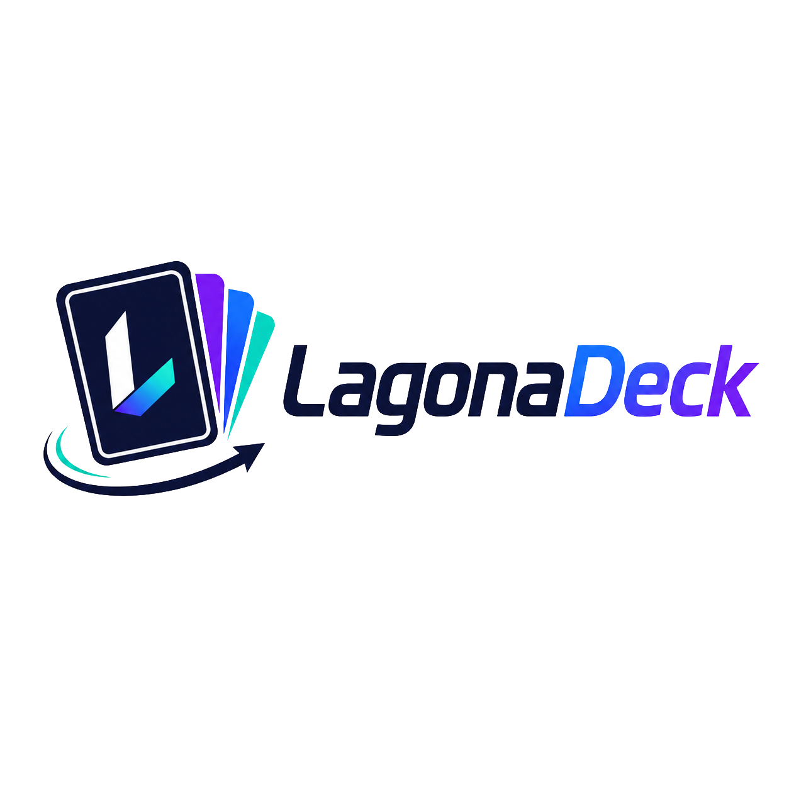

<p align="center">
  
</p>

# LagonaDeck

**LagonaDeck** est une application ERP destinée aux particuliers et professionnels qui achètent et revendent des cartes à collectionner **TCG (Trading Card Games)** dans une logique de _flipping_.

L'objectif de LagonaDeck est de centraliser l'ensemble du cycle de vie d'une carte, depuis son acquisition jusqu'à sa revente, tout en permettant de suivre précisément le stock, les coûts, les prix du marché et la rentabilité.

L'application permet notamment de gérer les achats de cartes par lots, de répartir dynamiquement le coût d'un lot entre les différentes cartes, de suivre l'évolution du stock, d'enregistrer les ventes et de calculer automatiquement les marges, bénéfices et retours sur investissement.

LagonaDeck intègre également un système de **workspaces multi-utilisateurs**, permettant à plusieurs personnes de gérer un même inventaire tout en conservant une séparation claire entre différents espaces de travail.

Les données du marché peuvent être utilisées afin de comparer le coût d'acquisition d'une carte à sa valeur actuelle et ainsi faciliter les décisions de vente.

## Fonctionnalités principales

- Gestion des utilisateurs et des workspaces
- Gestion d'un catalogue de cartes TCG
- Gestion des achats et des lots
- Allocation dynamique du coût d'acquisition d'un lot
- Gestion et suivi du stock
- Suivi des prix du marché
- Gestion des ventes et des frais associés
- Calcul des bénéfices, marges et ROI
- Historique et analyse des performances
- Tableau de bord avec indicateurs financiers et statistiques
- Gestion des médias (photos des cartes)

## Architecture

Un projet indépendant par dossier, sans monorepo ni lib partagée :

```text
frontend/           Angular, appelle uniquement l'api-gateway
api-gateway/        NestJS, seul point d'entrée HTTP (sans base)
identity-service/   NestJS + Prisma : utilisateurs
media-service/      NestJS + Prisma + object storage S3 : médias
```

Communication entre services :

- **Synchrone** (l'appelant a besoin de la réponse) : `fetch` natif avec
  `signal: AbortSignal.timeout(5000)`, URL en variable d'env (`SERVICE_X_URL`).
- **Asynchrone** (événements, traitements longs) : RabbitMQ via
  `@nestjs/microservices`, une file durable par consumer, ack manuel après
  traitement, `eventId` (`crypto.randomUUID()`) pour ignorer un doublon.

## Démarrage

Dans chaque dossier :

```bash
npm install
cp .env.example .env   # services avec base : DATABASE_URL, S3…
npm run start:dev      # frontend : npm start
npm run build
npm test               # identity-service, media-service
```

PostgreSQL et MinIO sont à lancer à part. Le client Prisma (`src/generated/`)
est régénéré par `build`, `start:dev` et `test` ; `npm run db:migrate` applique
les migrations.

## Objectif du projet

LagonaDeck est réalisé dans le cadre d'un **projet académique en informatique** par une équipe de quatre développeurs.

Le projet a pour objectif de mettre en pratique plusieurs concepts de développement logiciel modernes :

- Architecture microservices
- Architecture orientée événements
- API Gateway
- Communication asynchrone
- Database per Service
- Applications frontend/backend TypeScript
- Gestion d'état avec NgRx
- APIs REST
- Conteneurisation avec Docker
- Travail collaboratif avec Git et GitHub
- Intégration et tests automatisés

L'objectif n'est donc pas uniquement de développer un gestionnaire de cartes TCG, mais de construire une application complète permettant d'expérimenter une **architecture distribuée réaliste** sur un domaine métier concret.

## Licence

Ce dépôt est public uniquement aux fins de consultation. Tous droits réservés.
Aucune permission d'utilisation, de copie, de téléchargement, de modification
ou de redistribution n'est accordée.
Voir [LICENSE](LICENSE).
