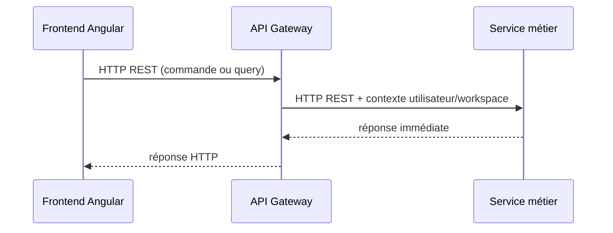
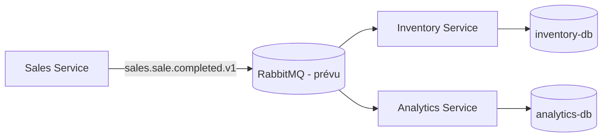

# Communication entre composants

## Règle de choix

| Besoin                                               | Canal                     | Statut                                                            |
| ---------------------------------------------------- | ------------------------- | ----------------------------------------------------------------- |
| Commande ou query nécessitant une réponse immédiate  | HTTP REST via API Gateway | Frontend et services HTTP existent ; routage métier à implémenter |
| Propagation d'un fait métier vers plusieurs services | RabbitMQ                  | Prévu ; non configuré dans le dépôt                               |

Le frontend appelle uniquement l'API Gateway. Une longue chaîne d'appels
synchrones entre microservices doit être évitée : elle augmente le couplage et
la latence.

## REST synchrone

Le Gateway porte le contexte d'accès (utilisateur et workspace) vers le service
concerné. Un service renvoie la réponse demandée sans que le frontend ait à
connaître son adresse ou sa persistance.

## Événements asynchrones

RabbitMQ est réservé aux événements métier ; il ne remplace pas une query REST.
Quand le broker sera mis en œuvre, un producteur publiera un fait déjà survenu,
et les consommateurs construiront leur propre état. Une confirmation de vente,
par exemple, pourra alimenter Inventory et Analytics ; la mise à jour de leurs
bases sera éventuellement cohérente.

Les contrats doivent être versionnables, par exemple
`sales.sale.completed.v1`. `libs/contracts/events` est le lieu prévu pour leur
définition TypeScript ; aucun contrat n'y est encore présent.

