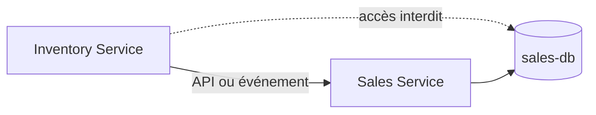

# Données et Prisma

## Database per Service

La règle est stricte : chaque microservice métier est seul responsable de sa
base, de son schéma Prisma et de ses migrations. `api-gateway` n'a aucune base.
Un service ne se connecte jamais à la base d'un autre ; les échanges passent par
REST ou, pour la propagation de faits, par RabbitMQ.

| Service             | Base logique visée | Schéma présent | Modèle de démarrage |
| ------------------- | ------------------ | -------------- | ------------------- |
| `identity-service`  | `identity-db`      | Oui            | `User`              |
| `catalog-service`   | `catalog-db`       | Oui            | `Product`           |
| `inventory-service` | `inventory-db`     | Oui            | `StockItem`         |
| `sales-service`     | `sales-db`         | Oui            | `Order`             |
| `analytics-service` | `analytics-db`     | Oui            | `Event`             |
| `media-service`     | `media-db`         | Oui            | `MediaAsset`        |

Les noms de base sont des noms logiques documentés : le dépôt configure chaque
connexion via `DATABASE_URL` dans son `prisma.config.ts`, mais ne versionne pas
de fichiers d'environnement ni d'infrastructure PostgreSQL locale. Aucun dossier
`prisma/migrations/` n'est présent à ce jour.

## Mise en œuvre actuelle

Chaque service ci-dessus contient :

```text
apps/<service>/
├── prisma.config.ts
├── prisma/schema.prisma
└── src/generated/prisma/       # généré, non versionné
```

Prisma 7 utilise le provider PostgreSQL et le driver adapter `@prisma/adapter-pg`.
Les modèles existants sont des modèles de départ, pas encore le modèle complet
du domaine métier.

## Interdictions



Il n'existe pas de schéma Prisma central et il ne doit pas en être créé. Les
entités métier, repositories et migrations restent dans le service propriétaire.
