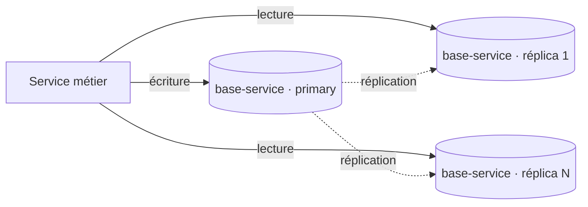
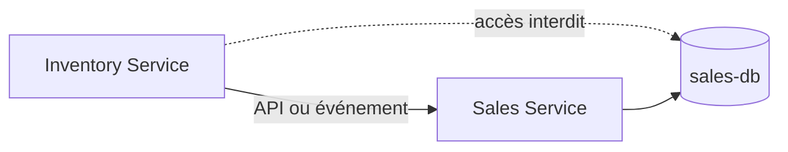

# Données et Prisma

## Database per Service

La règle est stricte : chaque microservice métier est seul responsable de sa
base, de son schéma Prisma et de ses migrations. `api-gateway` n'a aucune base.
Un service ne se connecte jamais à la base d'un autre ; les échanges passent par
REST ou, pour la propagation de faits, par RabbitMQ.

| Service             | Base logique visée | Schéma présent | Modèle de démarrage |
| ------------------- | ------------------ | -------------- | ------------------- |
| `identity-service`  | `identity-db`      | Oui            | `User`              |
| `catalog-service`   | `catalog-db`       | Oui            | `Product`           |
| `inventory-service` | `inventory-db`     | Oui            | `StockItem`         |
| `sales-service`     | `sales-db`         | Oui            | `Order`             |
| `analytics-service` | `analytics-db`     | Oui            | `Event`             |
| `media-service`     | `media-db`         | Oui            | `MediaAsset`        |

Les noms de base sont des noms logiques documentés : le dépôt configure chaque
connexion via `DATABASE_URL` dans son `prisma.config.ts`, mais ne versionne pas
de fichiers d'environnement ni d'infrastructure PostgreSQL locale. Aucun dossier
`prisma/migrations/` n'est présent à ce jour.

## Mise en œuvre actuelle

Chaque service ci-dessus contient :

```text
apps/<service>/
├── prisma.config.ts
├── prisma/schema.prisma
└── src/generated/prisma/       # généré, non versionné
```

Prisma 7 utilise le provider PostgreSQL et le driver adapter `@prisma/adapter-pg`.
Les modèles existants sont des modèles de départ, pas encore le modèle complet
du domaine métier.

## Scalabilité : réplication des bases par service

La règle _database per service_ porte sur les **frontières** de données, pas sur
leur mise à l'échelle ni leur disponibilité. Une base de service reste par défaut
une instance PostgreSQL unique : elle borne le débit de lecture et constitue un
point de défaillance unique.

Pour y remédier, la base d'un service peut être déployée en **plusieurs instances
répliquées**, chacune détenant une **copie complète** des données du service
(réplication, **pas** partitionnement). Objectif : passer à l'échelle en
**lecture** et améliorer la **disponibilité**. Voir
[ADR 0006](../adr/0006-replication-bases-service.md).

Cette capacité **complète** la règle _database per service_, elle ne la remplace
pas : la réplication se fait toujours **à l'intérieur** de la frontière d'un
service, jamais entre services. Toutes les instances d'une base contiennent les
mêmes lignes ; il n'y a **pas de sharding**.



Points définis au moment de la mise en œuvre, par service :

- **Topologie** — **primary + réplicas en lecture** : un seul nœud (le primary)
  accepte les écritures, les réplicas servent les lectures et reçoivent une copie du
  primary. Le multi-maître est écarté.
- **Répartition lecture/écriture** — les écritures visent le primary, les lectures
  peuvent viser un réplica ; l'application (ou sa couche d'accès) route en
  conséquence.
- **Réconciliation entre instances** — rattrapage du retard de réplication
  (_replication lag_), resynchronisation d'un réplica après panne, et promotion d'un
  réplica en primary lors d'un basculement (_failover_). Les opérations de
  réconciliation doivent être rejouables sans créer de doublons ni perdre
  d'écritures.
- **Cohérence** — une lecture sur une copie peut être légèrement en retard ; la
  cohérence entre copies est **éventuelle**.

Un service peu sollicité peut rester en instance unique : la réplication est une
capacité disponible, pas une obligation systématique.

## Interdictions



Il n'existe pas de schéma Prisma central et il ne doit pas en être créé. Les
entités métier, repositories et migrations restent dans le service propriétaire.
