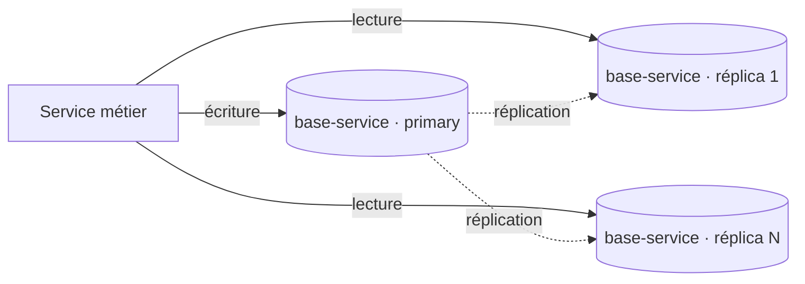
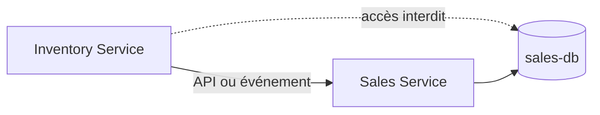

# Données et Prisma

## Database per Service

La règle est stricte : chaque microservice métier est seul responsable de sa
base, de son schéma Prisma et de ses migrations. `api-gateway` n'a aucune base.
Un service ne se connecte jamais à la base d'un autre ; les échanges passent par
REST ou, pour la propagation de faits, par RabbitMQ.

| Service             | Base logique visée | Modèles Prisma                                                                                |
| ------------------- | ------------------ | --------------------------------------------------------------------------------------------- |
| `identity-service`  | `identity-db`      | `User` (modèle de démarrage)                                                                  |
| `catalog-service`   | `catalog-db`       | `Game`, `CardSet`, `Card`, `CardVariant`, `ExternalId`, `MarketPrice`                         |
| `inventory-service` | `inventory-db`     | `Supplier`, `Purchase`, `PurchaseFee`, `Lot`, `InventoryItem`, `StockMovement`, `Reservation` |
| `sales-service`     | `sales-db`         | `Marketplace`, `Sale`, `SaleLine`, `SaleFee`, `SaleReturn`                                    |
| `analytics-service` | `analytics-db`     | `Event`, `DailyWorkspaceKpi`, `ItemPerformance`                                               |
| `media-service`     | `media-db`         | `MediaAsset`                                                                                  |

Les noms de base sont des noms logiques documentés : le dépôt configure chaque
connexion via `DATABASE_URL` dans son `prisma.config.ts` et ne versionne pas de
fichiers d'environnement. Catalog, Inventory, Sales, Analytics et Media
versionnent une migration dans `prisma/migrations/` ; elle s'applique avec
`npm run db:deploy -w @lagonadeck/<service>`. Aucune étape de l'environnement
Docker de développement ne l'applique automatiquement à ce jour : la commande
pour les six services figure dans le
[guide Docker de développement](../development/docker-development.md#créer-les-tables-migrations-prisma).

## Mise en œuvre actuelle

Chaque service ci-dessus contient :

```text
apps/<service>/
├── prisma.config.ts
├── prisma/schema.prisma       # ou prisma/schema/ quand un fragment est partagé
├── prisma/migrations/          # migrations versionnées, quand le service en a
└── src/generated/prisma/       # généré, non versionné
```

Prisma 7 utilise le provider PostgreSQL et le driver adapter `@prisma/adapter-pg`.
Les modèles de Catalog, Inventory, Sales et Analytics couvrent le cycle
achat → stock → vente avec un jeu de champs volontairement minimal ; un champ
facultatif s'ajoute par migration dans le seul service concerné. Media possède
son modèle `MediaAsset` et ses endpoints ; seul Identity conserve son modèle de
démarrage, développé sur une branche dédiée.

### Conventions des schémas

Elles s'appliquent aux quatre services modélisés et ont vocation à être reprises
par Identity et Media.

- Identifiants `uuid` (`@db.Uuid`) sur toutes les tables.
- Une donnée appartenant à un autre service est référencée par son UUID, **sans
  clé étrangère** : `workspaceId`, `cardVariantId`, `inventoryItemId`, `saleId`…
  Les relations Prisma (`@relation`) restent internes à une base.
- Montants en `Decimal` accompagnés d'une devise ISO 4217 (`@db.Char(3)`).
- Les tables de faits (`MarketPrice`, `StockMovement`, `Event`) sont en ajout
  seul et n'ont pas de `updatedAt`.
- Une liste de valeurs que l'utilisateur doit pouvoir étendre est une **table
  de référence** scopée par `workspaceId`, jamais une énumération : les cas ne
  peuvent pas être connus à l'avance (`ricardo.ch`, un salon local…). C'est le
  rôle de `Marketplace` (canaux de vente) et de `Supplier` (canaux d'achat).
  Une entrée déjà référencée s'archive (`isArchived`) au lieu d'être supprimée.
- Une énumération utilisée par plusieurs services est définie une seule fois
  dans `libs/contracts/prisma/shared-enums.prisma`, puis propagée par
  `npm run contracts:sync` dans le dossier `prisma/schema/` de chaque service
  concerné. Deux bases ne peuvent pas partager un type `ENUM` PostgreSQL : la
  copie est donc inévitable, mais elle est générée et vérifiée par la CI, pas
  maintenue à la main. `CardCondition` suit cette règle (catalog et inventory).
- `inventory-service` active la preview feature Prisma `partialIndexes` : un
  index unique partiel n'autorise qu'une `Reservation` de statut `ACTIVE` par
  exemplaire, ce qui protège de la double vente au niveau de PostgreSQL.

## Scalabilité : réplication des bases par service

La règle _database per service_ porte sur les **frontières** de données, pas sur
leur mise à l'échelle ni leur disponibilité : une base de service reste par défaut
une instance PostgreSQL unique, qui borne le débit de lecture et constitue un point
de défaillance unique.

Pour y remédier, la base d'un service peut être déployée en **plusieurs instances
répliquées** (topologie **primary + réplicas en lecture**), chacune détenant une
**copie complète** des données — réplication, **pas** sharding, et toujours à
l'intérieur de la frontière d'un service. L'objectif est de passer à l'échelle en
**lecture** et d'améliorer la **disponibilité** ; la réplication est une capacité
disponible, pas une obligation systématique.



Le détail de la décision — répartition lecture/écriture, réconciliation entre
instances (retard de réplication, resynchronisation, basculement) et cohérence
éventuelle — est traité dans l'[ADR 0006](../adr/0006-replication-bases-service.md).

## Interdictions



Il n'existe pas de schéma Prisma central et il ne doit pas en être créé. Les
entités métier, repositories et migrations restent dans le service propriétaire.
