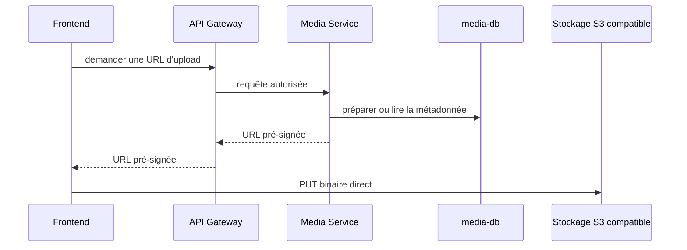

# Médias et stockage objet

## Responsabilité de Media Service

`media-service` est l'unique service applicatif autorisé à accéder au stockage
compatible S3. Les autres services doivent demander une opération au Media
Service ; ils ne reçoivent jamais les identifiants du bucket.

Le service distingue :

- les binaires, stockés dans le bucket S3 compatible ;
- les métadonnées, stockées dans `media-db` via Prisma.

Le modèle `MediaAsset` actuellement présent contient notamment `id`, `ownerId`,
`storageKey`, `contentType`, `sizeBytes`, les dimensions optionnelles, un statut
et les dates de création/mise à jour. Les champs `workspaceId`, `bucket`,
`fileName` et `createdBy` font partie du modèle cible décrit par le projet, mais
ne sont pas encore dans le schéma versionné.

## État actuel

`StorageService` est déjà implémenté avec `@aws-sdk/client-s3` et
`@aws-sdk/s3-request-presigner`. Il crée des URLs pré-signées PUT et GET,
configurées par `MEDIA_S3_ENDPOINT`, `MEDIA_S3_BUCKET`, `MEDIA_S3_REGION`,
`MEDIA_S3_FORCE_PATH_STYLE` et les identifiants S3. Le bucket par défaut est
`lagonadeck-media`.

Les contrôleurs HTTP, la validation MIME/taille, la persistance des métadonnées,
la suppression, l'association aux ressources métier et la configuration du
stockage local restent **à implémenter**. Aucun MinIO ou autre stockage local
n'est configuré dans le dépôt : la documentation ne présume donc pas du produit
qui sera choisi pour le développement local.

## Flux d'upload visé

Le Media Service peut remettre une URL pré-signée au frontend. Le navigateur
envoie alors le binaire directement au stockage ; l'API ne sert pas de proxy des
octets.

Le stockage direct par le frontend est limité à l'URL et au délai autorisés par
Media Service. Les services Catalog, Inventory, Sales et Analytics ne doivent
pas appeler le bucket directement.
