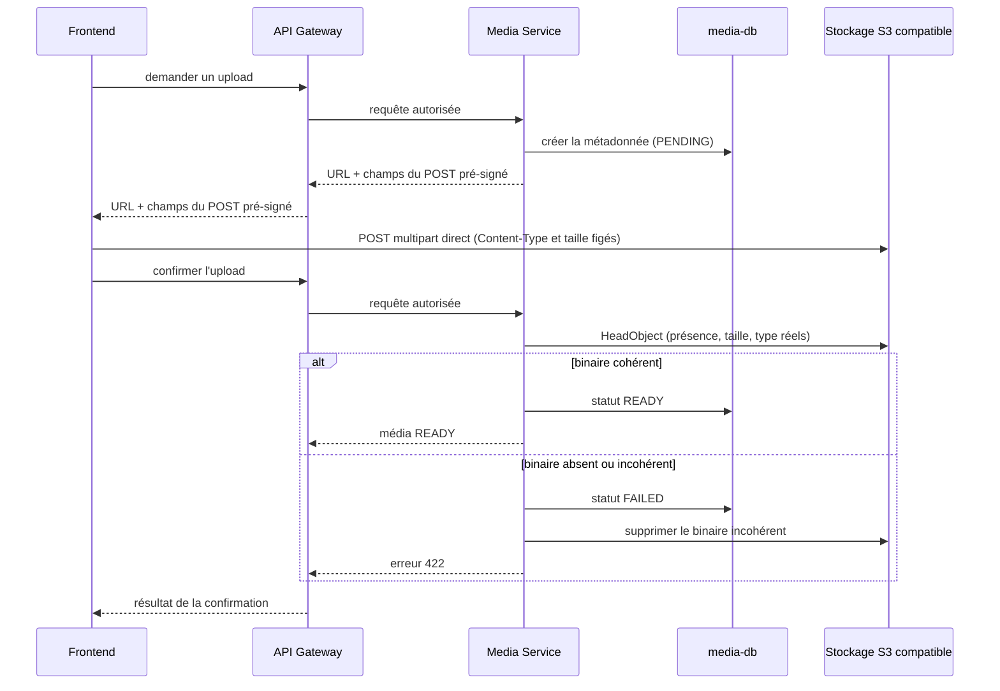

# Médias et stockage objet

## Responsabilité de Media Service

`media-service` est l'unique service applicatif autorisé à accéder au stockage
compatible S3. Les autres services doivent demander une opération au Media
Service ; ils ne reçoivent jamais les identifiants du bucket.

Le service distingue :

- les binaires, stockés dans le bucket S3 compatible ;
- les métadonnées, stockées dans `media-db` via Prisma.

Le modèle `MediaAsset` actuellement présent contient `id`, `ownerId`,
`fileName`, `storageKey`, `kind` (`IMAGE`/`DOCUMENT`), `contentType`,
`sizeBytes`, les dimensions optionnelles, un statut et les dates de
création/mise à jour. Les champs `workspaceId`, `bucket` et `createdBy` font
partie du modèle cible décrit par le projet, mais ne sont pas encore dans le
schéma versionné.

## État actuel

`StorageService` est implémenté avec `@aws-sdk/client-s3`,
`@aws-sdk/s3-presigned-post` et `@aws-sdk/s3-request-presigner` : POST
pré-signé pour l'upload, URL pré-signée GET pour le téléchargement,
vérification de la présence d'un binaire (`statObject`, via `HeadObject`) et
suppression (`deleteObject`), configurés par `MEDIA_S3_ENDPOINT`,
`MEDIA_S3_BUCKET`, `MEDIA_S3_REGION`, `MEDIA_S3_FORCE_PATH_STYLE` et les
identifiants S3. Le bucket par défaut est `lagonadeck-media`. MinIO est
configuré pour le développement local dans
`infrastructure/docker-compose.dev.yml`.

L'upload utilise un **POST pré-signé** (formulaire multipart, via une policy
S3 signée) plutôt qu'un PUT pré-signé : contrairement à un PUT, une policy de
POST permet de figer le `Content-Type` (condition `eq`) et la taille exacte du
fichier (condition `content-length-range`) dans la signature elle-même. Le
stockage S3/MinIO rejette alors le POST (403/400) si le binaire envoyé ne
correspond pas exactement à ce qui a été déclaré lors de la demande d'upload —
un PUT pré-signé ne peut pas offrir cette garantie, l'en-tête `Content-Type`
n'étant jamais inclus dans le calcul de signature du SDK AWS.

Le contrôleur HTTP (`MediaController`) expose :

- `POST /media` : valide le type MIME et la taille annoncée, crée la
  métadonnée (`PENDING`) et renvoie l'`id` du média ainsi que l'URL et les
  champs (`uploadFields`) du POST pré-signé à effectuer ;
- `POST /media/:id/confirm` : **étape obligatoire** après l'upload — vérifie
  la présence, la taille et le type de contenu réels du binaire via
  `HeadObject`, passe le média en `READY`, ou en `FAILED` (en supprimant le
  binaire incohérent, après avoir fixé l'état `FAILED`) si l'un d'eux ne
  correspond pas ;
- `GET /media` et `GET /media/:id` : lecture des métadonnées, avec URL de
  téléchargement pré-signée une fois le média `READY` ;
- `DELETE /media/:id` : supprime le binaire puis la métadonnée.

Un job planifié (`MediaService.purgeStalePendingAssets`, `@nestjs/schedule`,
intervalle `MEDIA_PENDING_CLEANUP_INTERVAL_MS`) purge périodiquement les
médias restés `PENDING` après l'expiration de leur fenêtre d'upload : sans
cette purge, un client qui ne complète jamais l'upload (ou qui n'appelle
jamais `confirm`) laisserait une métadonnée orpheline indéfiniment.

Restent **à implémenter** : les médias par workspace, l'association explicite
aux ressources métier des autres services, et l'authentification des appelants
(aucun service du monorepo n'a encore de mécanisme d'auth — l'`ownerId` est
actuellement fourni tel quel par l'appelant).

## Flux d'upload

Le Media Service remet une URL et des champs de formulaire pré-signés au
frontend. Le navigateur envoie alors le binaire directement au stockage par un
POST multipart ; l'API ne sert pas de proxy des octets. Le flux ne se termine
pas au POST : le client doit ensuite appeler `confirm` pour que le média
devienne exploitable.

Le stockage direct par le frontend est limité à l'URL et au délai autorisés par
Media Service. Les services Catalog, Inventory, Sales et Analytics ne doivent
pas appeler le bucket directement.
