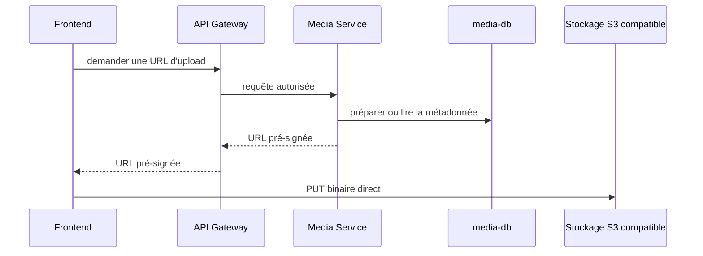

# Médias et stockage objet

## Responsabilité de Media Service

`media-service` est l'unique service applicatif autorisé à accéder au stockage
compatible S3. Les autres services doivent demander une opération au Media
Service ; ils ne reçoivent jamais les identifiants du bucket.

Le service distingue :

- les binaires, stockés dans le bucket S3 compatible ;
- les métadonnées, stockées dans `media-db` via Prisma.

Le modèle `MediaAsset` actuellement présent contient `id`, `ownerId`,
`fileName`, `storageKey`, `kind` (`IMAGE`/`DOCUMENT`), `contentType`,
`sizeBytes`, les dimensions optionnelles, un statut et les dates de
création/mise à jour. Les champs `workspaceId`, `bucket` et `createdBy` font
partie du modèle cible décrit par le projet, mais ne sont pas encore dans le
schéma versionné.

## État actuel

`StorageService` est implémenté avec `@aws-sdk/client-s3` et
`@aws-sdk/s3-request-presigner` : URLs pré-signées PUT/GET, vérification de la
présence d'un binaire (`statObject`, via `HeadObject`) et suppression
(`deleteObject`), configurés par `MEDIA_S3_ENDPOINT`, `MEDIA_S3_BUCKET`,
`MEDIA_S3_REGION`, `MEDIA_S3_FORCE_PATH_STYLE` et les identifiants S3. Le
bucket par défaut est `lagonadeck-media`. MinIO est configuré pour le
développement local dans `infrastructure/docker-compose.dev.yml`.

Le contrôleur HTTP (`MediaController`) expose :

- `POST /media` : valide le type MIME et la taille annoncée, crée la
  métadonnée (`PENDING`) et renvoie l'`id` du média ainsi qu'une URL pré-signée
  d'upload ;
- `POST /media/:id/confirm` : vérifie la présence du binaire et sa cohérence
  (taille, type de contenu) via `HeadObject`, passe le média en `READY`, ou en
  `FAILED` (en supprimant le binaire incohérent) sinon ;
- `GET /media` et `GET /media/:id` : lecture des métadonnées, avec URL de
  téléchargement pré-signée une fois le média `READY` ;
- `DELETE /media/:id` : supprime le binaire puis la métadonnée.

Restent **à implémenter** : les médias par workspace, l'association explicite
aux ressources métier des autres services, et l'authentification des appelants
(aucun service du monorepo n'a encore de mécanisme d'auth — l'`ownerId` est
actuellement fourni tel quel par l'appelant).

## Flux d'upload visé

Le Media Service peut remettre une URL pré-signée au frontend. Le navigateur
envoie alors le binaire directement au stockage ; l'API ne sert pas de proxy des
octets.

Le stockage direct par le frontend est limité à l'URL et au délai autorisés par
Media Service. Les services Catalog, Inventory, Sales et Analytics ne doivent
pas appeler le bucket directement.
