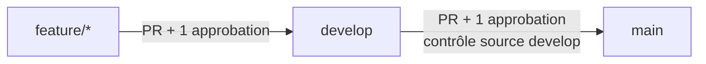

# Qualité, CI et flux Git

Ce document décrit les contrôles de qualité et le flux de contribution de
LagonaDeck. Les contrôles locaux accélèrent le retour au développeur ; la CI et
les protections GitHub restent la source d'autorité avant toute fusion.

## Commandes locales

À la racine du monorepo :

```bash
npm run format:check  # vérifie Prettier sur le dépôt
npm run lint          # lance le lint Nx de toutes les applications
npm test              # lance tous les tests Nx disponibles
npm run quality       # format:check puis lint
```

`npm run quality` est le contrôle de qualité de code : il doit réussir avant de
proposer une modification. Les avertissements ESLint n'échouent pas la commande ;
les erreurs, elles, la bloquent.

## Lefthook

[Lefthook](https://lefthook.dev/) est installé comme dépendance de développement.
Le script `prepare` lance automatiquement `lefthook install` après
`npm install` ou `npm ci` dans un clone Git.

Le hook `pre-push`, défini dans [`lefthook.yml`](../../lefthook.yml), exécute :

```text
npm run quality
```

Un push est donc annulé si Prettier ou le lint échoue. Comme tout hook local, il
peut être ignoré avec `git push --no-verify` ; ce contournement ne doit pas être
utilisé. La CI GitHub Actions refait les mêmes vérifications de manière
indépendante.

## GitHub Actions

Le workflow [`CI`](../../.github/workflows/ci.yml) s'exécute :

- sur chaque pull request ;
- à chaque push vers `develop` ou `main` ;
- manuellement via `workflow_dispatch`.

Chaque exécution installe les dépendances avec `npm ci` et publie trois checks :

| Check      | Commande               | Portée                                  |
| ---------- | ---------------------- | --------------------------------------- |
| `Prettier` | `npm run format:check` | tous les fichiers formatés par Prettier |
| `Lint`     | `npm run lint`         | toutes les applications Nx              |
| `Tests`    | `npm test`             | toutes les cibles de test Nx existantes |

Le frontend Angular ne possède pas encore de cible de test ; à ce stade, le job
`Tests` couvre les sept applications backend qui exposent une cible Nx `test`.

### Labels de pull request

Après les trois checks, le job `PR labels` applique sans supprimer les autres
labels de la PR :

| Résultat                 | Label                  |
| ------------------------ | ---------------------- |
| Tests réussis            | `Tests réussis`        |
| Tests échoués            | `Tests échoués`        |
| Prettier et lint réussis | `Code Quality réussie` |
| Prettier ou lint échoué  | `Code Quality échouée` |

La labellisation est exécutée uniquement pour les PR provenant d'une branche du
dépôt, afin de ne pas demander de permission d'écriture au token d'une PR forkée.

## Flux de branches



Les protections GitHub actives sont les suivantes :

| Branche cible | Règles                                                                                 |
| ------------- | -------------------------------------------------------------------------------------- |
| `develop`     | PR obligatoire, une approbation minimum, pas de push direct, force-push ou suppression |
| `main`        | mêmes règles ; seule une PR dont la source est `develop` peut être fusionnée           |

Le workflow
[`Main source branch policy`](../../.github/workflows/main-source-branch.yml)
fournit le check obligatoire qui rejette une source différente de `develop` pour
une PR vers `main`.

Les membres non administrateurs restent soumis à ces protections. Un propriétaire
du dépôt disposant des droits d'administration peut les contourner en cas
d'exception ; cette dérogation doit rester exceptionnelle. La branche `main` ne
doit donc normalement jamais recevoir un push direct ou une PR issue de
`feature/*`.

## Procédure de contribution

1. Créer une branche `feature/<sujet>` depuis `develop`.
2. Développer, puis exécuter `npm run quality` et `npm test`.
3. Pousser la branche : Lefthook réexécute la qualité avant le push.
4. Ouvrir une PR vers `develop` et obtenir une approbation.
5. Vérifier les checks CI et labels, puis fusionner dans `develop`.
6. Ouvrir une PR de `develop` vers `main`, obtenir une approbation et attendre le
   check de provenance de branche.

Seuls les contrôles CI et les protections GitHub déterminent si une fusion est
autorisée ; le hook Lefthook constitue une protection complémentaire locale.
