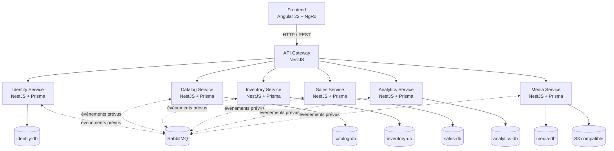
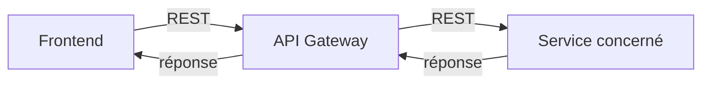
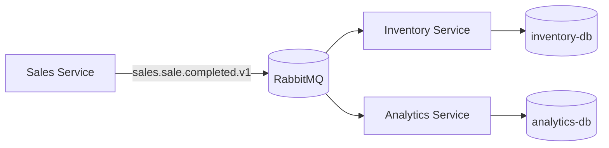
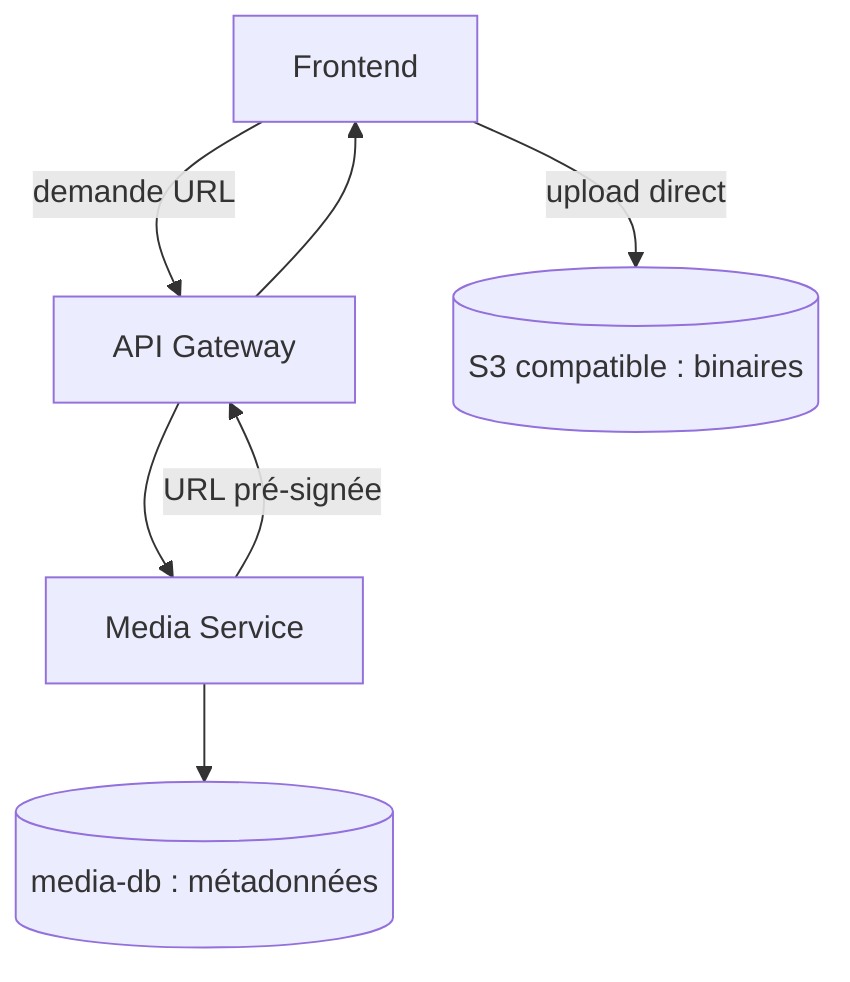
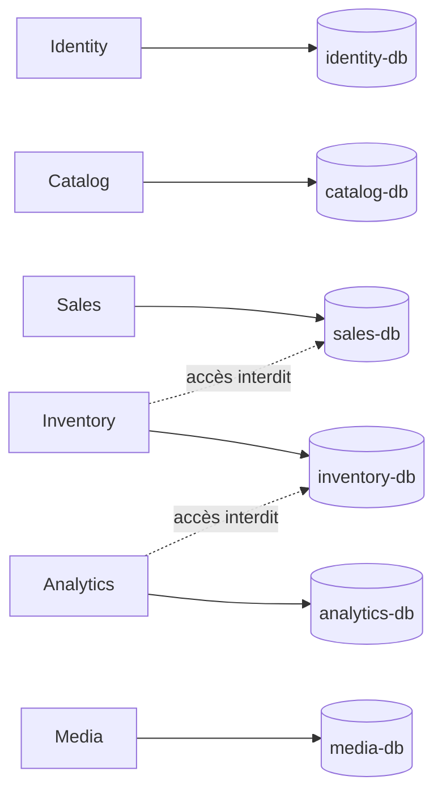
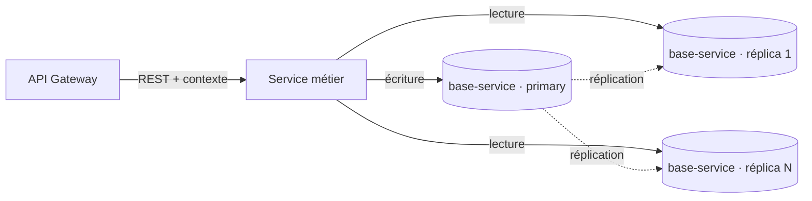

# Diagrammes d'architecture

Les libellés « prévu » désignent une cible d'architecture sans implémentation ou
configuration correspondante dans le dépôt actuel.

## Architecture globale

## Flux synchrone

## Flux événementiel prévu

## Flux média

## Isolation des bases

## Réplication d'une base de service

L'isolation entre services (ci-dessus) reste inchangée. À l'intérieur de la
frontière d'un service, la base peut être répliquée en plusieurs instances pour la
lecture et la disponibilité — voir
[ADR 0006](../adr/0006-replication-bases-service.md). Topologie primary + réplicas
en lecture : les écritures visent le primary, les lectures se répartissent sur les
réplicas.

