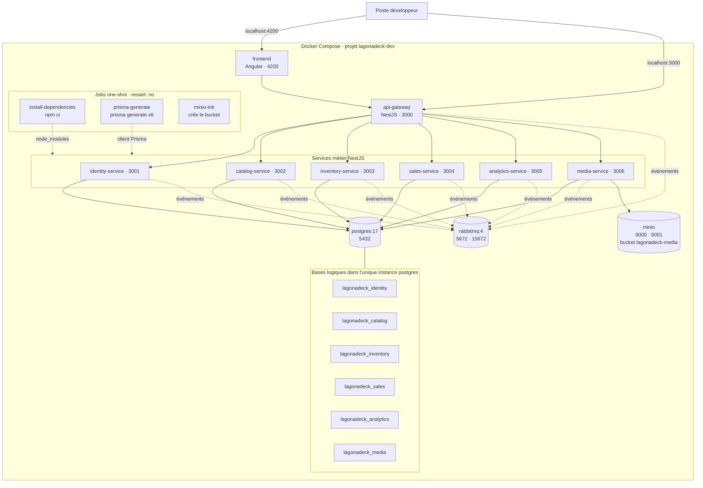
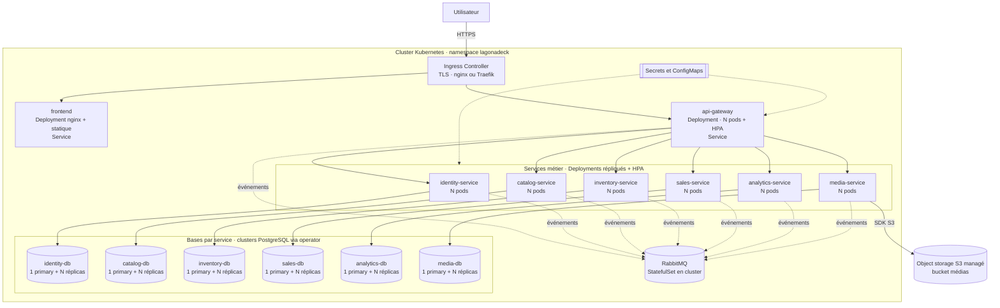
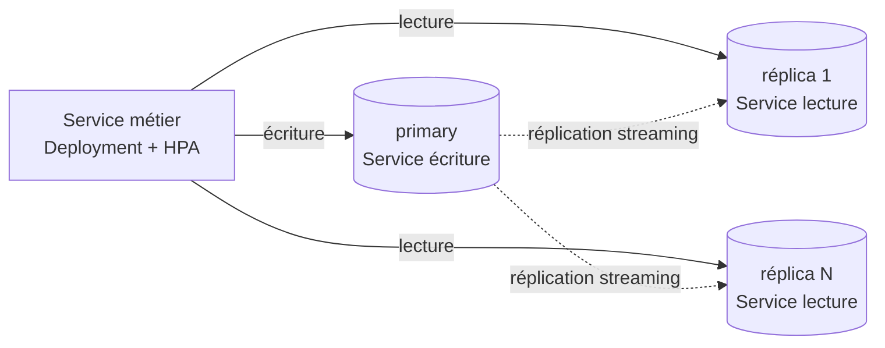
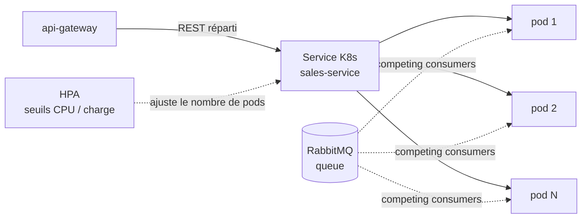

# Diagrammes d'infrastructure

Deux environnements sont décrits ici.

- L'environnement **dev** est **constaté** : il correspond à
  `infrastructure/docker-compose.dev.yml`.
- L'environnement **prod (Kubernetes)** est **proposé** : aucun manifeste
  Kubernetes n'est présent dans le dépôt à ce jour. Il matérialise l'architecture
  cible, dont la réplication des bases par service
  ([ADR 0006](../adr/0006-replication-bases-service.md)).

## Environnement de développement (Docker Compose)

En dev, une **seule instance PostgreSQL** héberge les six **bases logiques** (une
par service). Il n'y a **pas de réplication** : la réplication primary + réplicas
est une préoccupation de production.

Volumes Docker persistants : `node_modules`, `postgres_data`, `rabbitmq_data`,
`minio_data`. Les ports listés sont exposés sur l'hôte.

Un service peut aussi être répliqué localement pour tester le scaling :
`docker compose up --scale <service>=N`. Les N réplicas partagent la même image
et deviennent des _competing consumers_ sur RabbitMQ
([ADR 0004](../adr/0004-docker-build-load-balancing.md)).

## Environnement de production (Kubernetes, proposé)

En prod, chaque **base de service** devient un **cluster PostgreSQL** géré par un
operator (1 primary + N réplicas en lecture, réplication streaming — voir
[ADR 0006](../adr/0006-replication-bases-service.md)). Le stockage objet est un
service S3 managé, externe au cluster.

Côté calcul, **chaque micro-service est instancié en N pods et s'autoscale** : un
Deployment répliqué derrière un Service Kubernetes, un HPA qui ajuste le nombre de
pods selon la charge, et — pour les événements — des _competing consumers_ sur la
même queue RabbitMQ (voir [ADR 0004](../adr/0004-docker-build-load-balancing.md)).
Les services sont sans état partagé en mémoire ; le scaling ne demande pas de
coordination applicative.

### Détail d'un cluster de base (read/write split)

Zoom sur un cluster de base de service : les écritures visent le primary, les
lectures se répartissent sur les réplicas ; la réconciliation couvre le retard de
réplication, la resynchronisation et le basculement
([ADR 0006](../adr/0006-replication-bases-service.md)).

### Détail scaling d'un service

Chaque micro-service est répliqué en N pods derrière son Service Kubernetes. Le
HPA ajuste le nombre de pods selon la charge ; pour les événements, les pods sont
des _competing consumers_ sur la même queue RabbitMQ, qui répartit les messages
([ADR 0004](../adr/0004-docker-build-load-balancing.md)).

